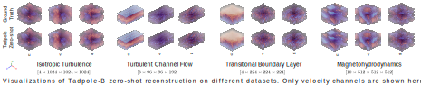
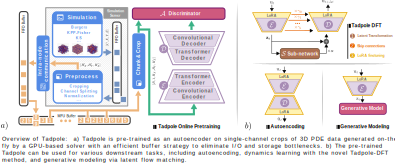

<h1 align="center">
  
  <br>Tadpole<br>
</h1>
<h4 align="center">Autoencoders as Foundation Models for 3D PDEs with Online Learning</h4>
<p align="center">
<a href="https://arxiv.org/abs/2408.11104">
  
</a>
<a href="https://huggingface.co/thuerey-group/Tadpole">
  
</a>
</p>


## About
* **What is Tadpole?**

Tadpole is a foundation model for three-dimensional partial differential equations (PDEs).

* **How is Tadpole different from existing PDE foundation models?**

Tadpole distinguishes itself from existing PDE foundation models in three key aspects: 

(1) Tadpole is pre-trained as an autoencoder to learn the inherent representation of PDE solutions, which is more generalizable than the traditional paradigm of training PDE foundation models directly on the dynamics evolution of PDE solutions.

(2) Tadpole is pretrained with online learning. which utilize a GPU-based solver to generate diverse data distribution without IO or storage bottlenecks induced by 3D PDE data.

(3) Tadpole is able to process multiple downstream tasks, including autoencoding, dynamics prediction, and generative modeling.



## Paper Info

<h4 align="center">Tadpole: Autoencoders as Foundation Models for 3D PDEs with Online Learning</h4>
<h6 align="center"><a href="https://qiauil.github.io/">Qiang Liu</a>, <a href="https://fkoehler.site/">Felix Koehler</a>, <a href="https://www.linkedin.com/in/benjamin-holzschuh-022768236/">Benjamin Holzschuh</a>, and <a href="https://ge.in.tum.de/about/n-thuerey/">Nils Thuerey</a></h6>

<h6 align="center">
     Technical University of Munich
</h6>

***Abstract:*** We introduce Tadpole, a novel foundation model for three-dimensional partial differential equations (PDEs) that addresses key challenges in transferability, scalability to high dimensionality, and multi-functionality. Tadpole is pre-trained as an autoencoder on synthetic 3D PDE data generated by an efficient online data-generation framework. This enables large-scale, diverse training without storage or I/O overhead, demonstrated by scaling to an equivalent of hundreds of terabytes of training data. By autoencoding single-channel spatial crops, Tadpole learns rich and transferable representations across heterogeneous physical systems with varying numbers of state variables and spatial resolutions. Although pre-trained solely as an autoencoder, Tadpole can be efficiently applied for multiple downstream tasks beyond reconstruction, including dynamics learning and generative modeling. For dynamics learning, we propose a novel parameter-efficient fine-tuning strategy that integrates low-rank adaptation, latent-space transformations, and reintroduced skip connections, achieving accurate temporal modeling with a minimal number of trainable parameters. Tadpole demonstrates strong fine-tuning performance across various downstream tasks, highlighting its versatility and effectiveness as a foundation model for 3D PDE learning.

***Read from:*** [[Arxiv](https://arxiv.org/abs/2408.11104)]

***Cite as:*** 

```latex
@inproceedings{Liu2026Tadpole,
  author = {Qiang Liu, Felix Koehler, Benjamin Holzschuh, and Nils Thuerey},
  title = {Tadpole: Autoencoders as Foundation Models for 3D PDEs with Online Learning},
  eprint={2408.11104},
  archivePrefix={arXiv},
  primaryClass={cs.LG},
  url={https://arxiv.org/abs/2408.11104}, 
}
```

## User Guide
### Installation
```bash
pip install git+https://github.com/tum-pbs/Tadpole
```
### Tutorials
1. [Load pre-trained weights and run models](https://github.com/tum-pbs/Tadpole/blob/main/tutorials/load_and_run.ipynb)
2. Run online learning framework (to be added).
3. Pre-train and fine-tune models (to be added).

## Additional Info
This project is part of the physics-based deep learning topic in [**Physics-based Simulation group**](https://ge.in.tum.de/) at TUM.